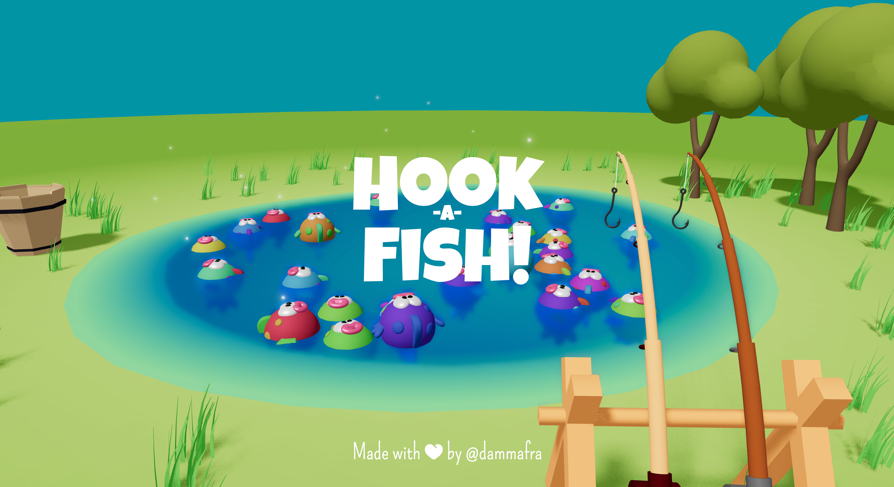
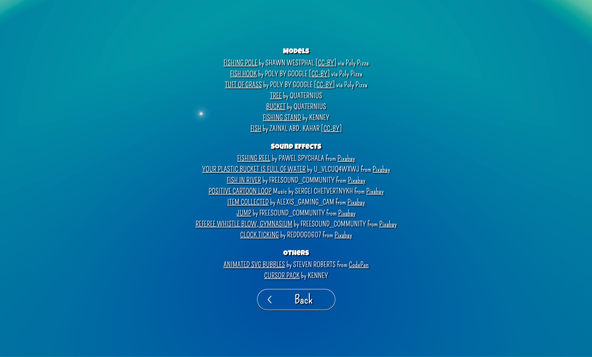

# 🎣 Hook-A-Fish!


> 🥇 1st place in the [Three.js Journey Challenge 019](https://threejs-journey.com/challenges/019-aquarium)

> Try it live here 👉 [hook-a-fish.vercel.app](https://hook-a-fish.vercel.app)

Dive into _Hook-A-Fish!_ Inspired by childhood memories, you will face a fun, fast-paced fishing challenge against the clock.

The goal is simple: catch as many fish as you can. Each fish you catch gives you extra time, and you can share your results with friends to challenge them.



## Technologies Used

- [React](https://react.dev/)
- [Typescript](https://www.typescriptlang.org/)
- [Tailwind](https://tailwindcss.com/)
- [@react-three/fiber](https://r3f.docs.pmnd.rs/getting-started/introduction)
- [@react-three/drei](https://drei.docs.pmnd.rs/getting-started/introduction)
- [@react-three/rapier](https://github.com/pmndrs/react-three-rapier)
- [@react-three/csg](https://github.com/pmndrs/react-three-csg)
- [@react-spring/web](https://www.react-spring.dev/)
- [zustand](https://zustand.docs.pmnd.rs/getting-started/introduction)
- [use-sound](https://github.com/joshwcomeau/use-sound?tab=readme-ov-file)
- [add-to-homescreen](https://github.com/philfung/add-to-homescreen)

## Setup

The repository contains two separate projects:

- **client** - React application in Typescript
- **server** - Colyseus application in Node

Currently, the server has not been developed yet and only the initial boilerplate is available.

```bash
# Create client and server .env files
cp client/.env.example client/.env && cp server/.env.example server/.env

# Install dependencies (only the first time)
npm install

# Run the local server at localhost:5173 and localhost:2567 for client and server respectively
npm run dev

# Build for production in the client/dist and server/dist directories
npm run build
```

## Features

TBD

### Mobile-Friendly

The game is optimized for mobile devices, providing a smooth and engaging experience on smartphones and tablets. It adapts to smaller screens, ensuring easy interaction and navigation on touch interfaces and can also be installed as PWA.

### Coming soon

- Zen mode
- Power-ups
- Multiplayer

## Credits

Check out the credits section in the project for a full list of resources used



## Feedback

If you have any suggestions, feel free to reach out!

## License

© 2025 Francesco Dammacco  
This project is licensed under the GNU Affero General Public License v3.0.  
See the [LICENSE](./LICENSE) file for details.
